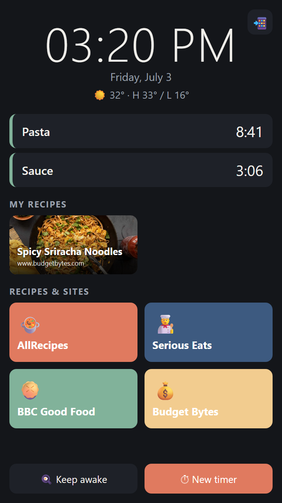
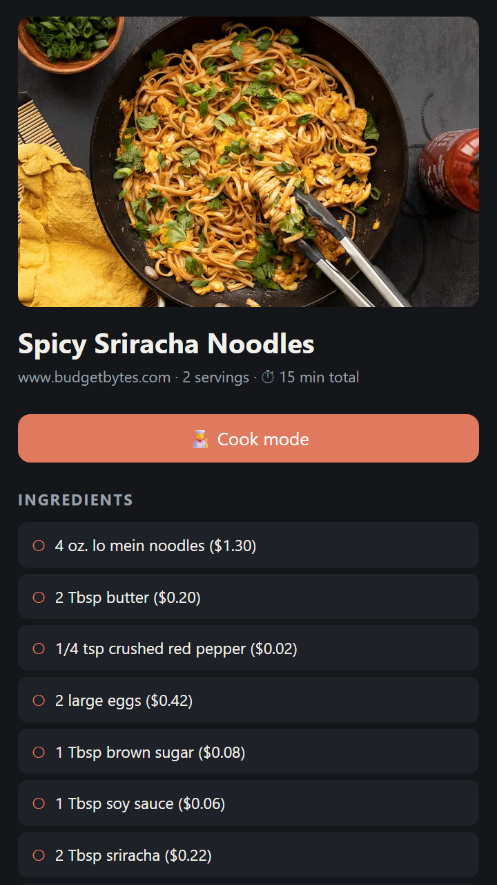
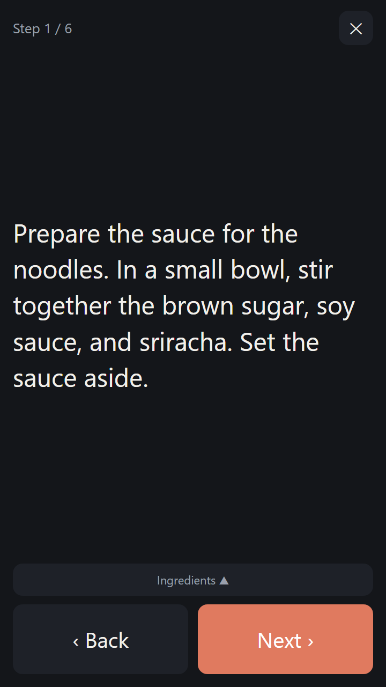
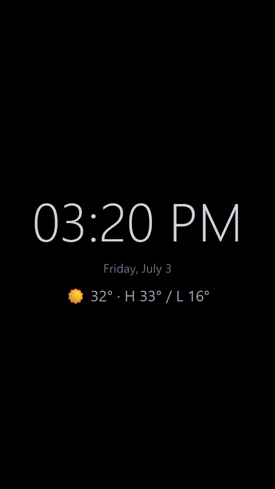
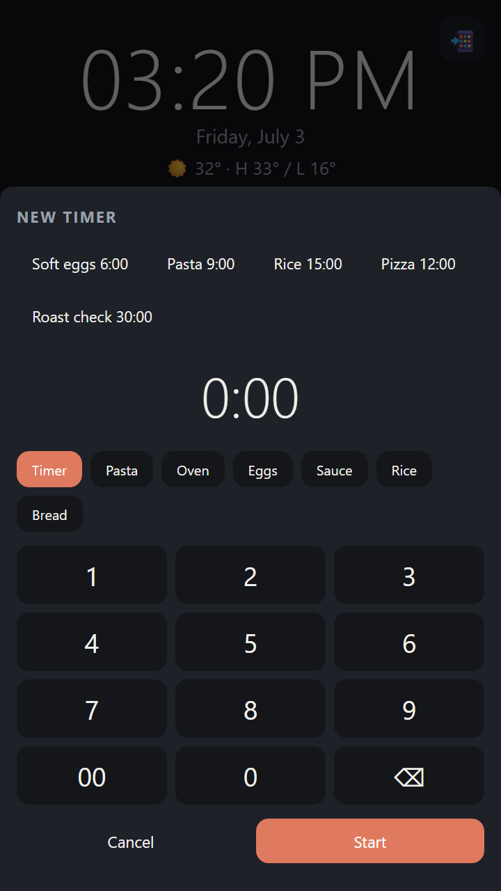
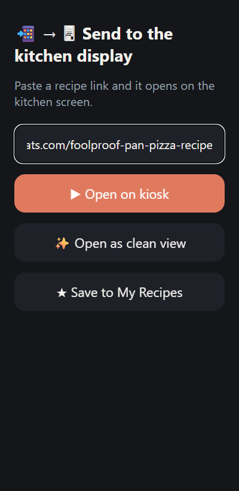
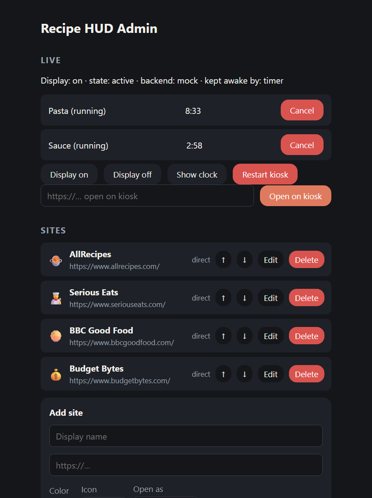

# Recipe HUD

A kitchen recipe kiosk for a Raspberry Pi 4 driving a VSDISPLAY 14.5" 2560×720
touch panel mounted portrait (720 wide × 2560 tall).

- **Launcher** — touch-first home screen with tiles for your saved recipe sites.
- **Browse anything** — Chromium kiosk shows any webpage; a floating overlay
  (Chromium extension) adds a Home button and cooking timers on every page.
- **Clean view** — extracts the recipe (ingredients, steps, times) out of
  ad-heavy sites and renders it big and clean; step times like "simmer 20
  minutes" become tap-to-start timer buttons. Cached, so it works offline.
- **Timers** — multiple named timers, server-side (they survive page
  navigation), with a loud alarm and full-screen flash.
- **My Recipes** — star any clean-view recipe to keep it forever (offline,
  survives the source site vanishing); browse from the launcher, add by URL
  from your phone.
- **Cook mode** — one step at a time in huge text with giant next/back
  buttons, tap-to-start timers inline, ingredients peek panel; keeps the
  screen awake while you cook.
- **Screen management** — idle → big clock (with weather via Open-Meteo, no
  API key) → display off; wakes on touch; night schedule with a warm dim
  veil; "keep awake" cooking mode; a running timer always keeps the screen
  available.
- **Send-to-kiosk** — scan the QR on the launcher (📲) to open `/send` on
  your phone; paste any recipe link and it opens on the kitchen display,
  optionally straight into clean view.
- **Admin panel** — manage sites, presets, timeouts and the display from any
  browser on your LAN: `http://<pi>.local:8000/admin` (default password
  `recipehud` — change it).

## Screenshots

| Launcher | Clean recipe view | Cook mode |
|---|---|---|
|  |  |  |

| Idle clock | New timer keypad | Send from phone |
|---|---|---|
|  |  |  |



## Development (any OS, no Pi needed)

```powershell
python -m venv .venv
.\.venv\Scripts\pip install -e .
.\scripts\dev.ps1          # seeds the DB, runs uvicorn --reload on :8000
```

- Launcher: http://localhost:8000/ (use DevTools device emulation at 720×2560)
- Admin: http://localhost:8000/admin
- Clean view: http://localhost:8000/recipe?url=<recipe-url>
- Extension: `chrome://extensions` → Developer mode → *Load unpacked* →
  `extension/` — then open any recipe site.
- Idle machine without hardware: `POST /api/debug/idle/{active|clock|off}` and
  `POST /api/debug/touch` (enabled by `RECIPEHUD_DEBUG=1`).
- WebSocket/alarm smoke test: `python scripts/ws_smoke.py` (server must be up).

## Deploying to the Pi

```bash
git clone <this repo> && cd recipe_hud
bash deploy/install.sh
sudo reboot
```

See [docs/DEPLOYMENT.md](docs/DEPLOYMENT.md) for the manual touch-rotation
step and troubleshooting, and [docs/ARCHITECTURE.md](docs/ARCHITECTURE.md)
for how the pieces fit together.
